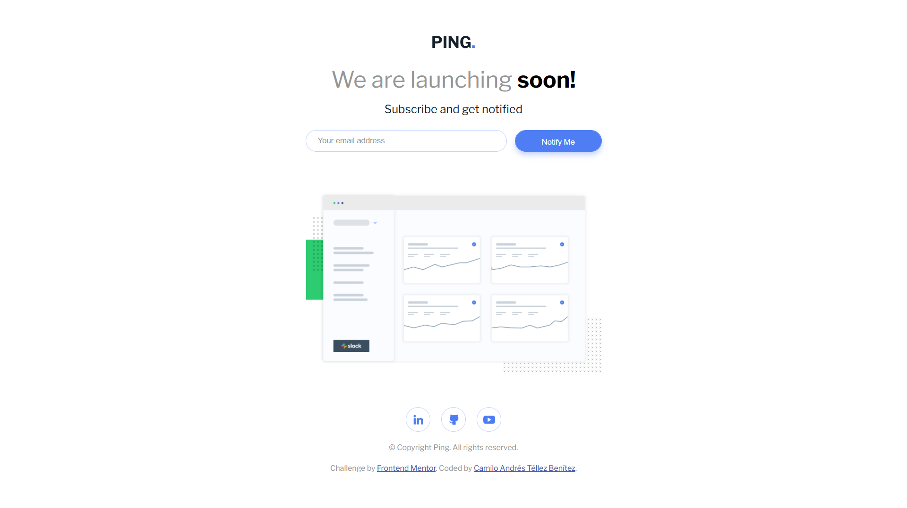
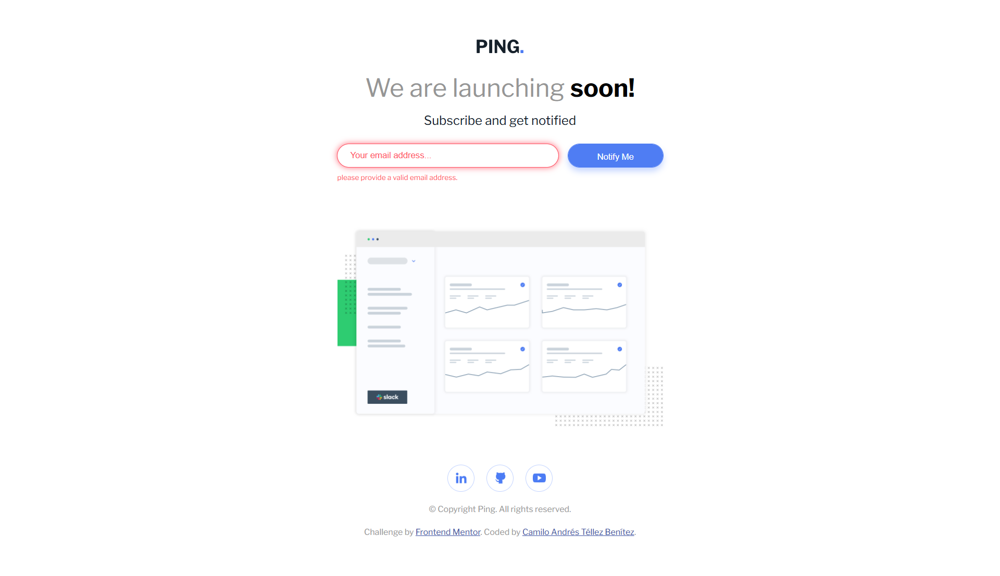

# Frontend Mentor - Ping Coming Soon Page 🚀

Solución al reto **[Ping Coming Soon Page](https://www.frontendmentor.io/challenges/ping-single-column-coming-soon-page-5cadd051fec04111f7b848da)** de *Frontend Mentor*.

## 📑 Tabla de contenidos
- [📌 Descripción general](#-descripción-general)
  - [🎯 Objetivo del reto](#-objetivo-del-reto)
  - [📸 Capturas de pantalla](#-capturas-de-pantalla)
  - [🔗 Enlace al proyecto](#-enlace-al-proyecto)
- [⚙️ Proceso de desarrollo](#️-proceso-de-desarrollo)
  - [🛠 Tecnologías utilizadas](#-tecnologías-utilizadas)
- [🙋‍♂️ Sobre mí](#-sobre-mí)

---

## 📌 Descripción general

### 🎯 Objetivo del reto
Los usuarios deben poder:
- Visualizar el diseño óptimo según el tamaño de pantalla de su dispositivo.
- Ver los estados *hover* en todos los elementos interactivos.
- Enviar su correo electrónico mediante un campo `input`.
- Recibir un mensaje de error si:
  - El campo está vacío.
  - El formato del correo es incorrecto (ejemplo válido: `nombre@dominio.com`).

---

### 📸 Capturas de pantalla

**Versión desktop (estado normal):**  

**Versión desktop (con errores):**  

---

### 🔗 Enlace al proyecto
- 🌐 **Sitio en línea:** [Ver sitio en línea](https://your-solution-url.com)  

---

## ⚙️ Proceso de desarrollo

### 🛠 Tecnologías utilizadas
- **HTML5 semántico** → estructura clara y accesible.
- **CSS3** → uso de variables personalizadas para mantener consistencia.
- **Flexbox** → disposición flexible y adaptable.
- **Mobile-first** → optimizado para dispositivos móviles desde el inicio.
- **JavaScript** → validación de formularios e interactividad.
- **Java + Spring Boot** → para el almacenamiento de correos en base de datos.

---

## 🙋‍♂️ Sobre mí
Soy estudiante de **ADSO** y del programa **ONE de Alura Latam y Oracle**.  
Me apasiona el desarrollo web y la construcción de soluciones prácticas.

📌 **Conecta conmigo:**
- [LinkedIn](http://www.linkedin.com/in/camilo-téllez)
- [YouTube](https://www.youtube.com/@camilotellez887)

> 💡 ¡Gracias por visitar este proyecto y seguir mi proceso de aprendizaje! 🚀✨
